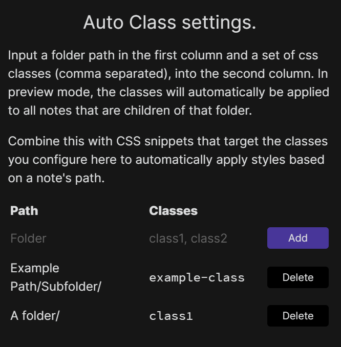

## Auto Class

An Obsidian plugin to automatically apply CSS classes to the markdown view as if you had added them in a `cssClasses` YAML key, based on a note's path and tags. Combine this with CSS snippets targeting a CSS class and you can have different snippets applied to different paths in a single vault without having to add any HTML or CSS classes yourself.

### Install

Install from the community plugin registry under the name Auto Class, by using the [BRAT plugin](https://github.com/TfTHacker/obsidian42-brat) with repository `OfficerHalf/obsidian-auto-class`, or manually by copying the release files (`main.js`, `manifest.json`, and `styles.css`) to `.obsidian/plugins/auto-class` in your vault.

### Use

Classes can be applied based on a note's path or tags. In settings, configure a folder path or tag and the classes to apply to the children of that folder or the files with that tag

Once configured, the next time the view is updated the classes will be applied.

### Contributing

Feel free to raise an issue or open a PR.
